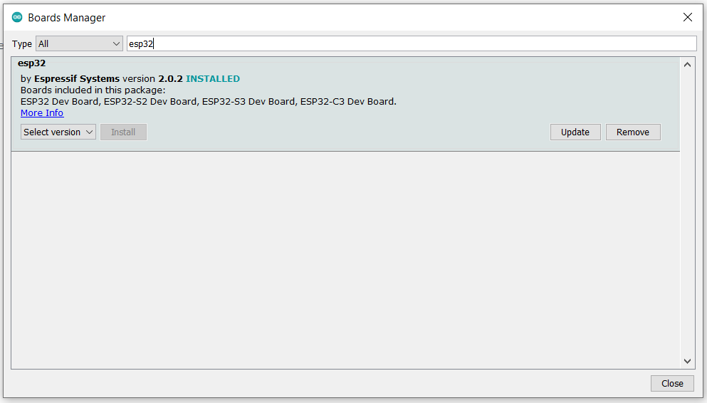

# Interface & Application programming

======

# Setup Development Environment for ESP32S2
## Installing ESP32

The first thing I did when setting up, was actually installing the esp32s2 board in the Arduino IDE.
I’m documenting this way later, so I already have it installed:



You can see I have to update. But I don't always do that. Since later versions limit some important stuff.

Then I just select the board I’m using and we’re good for setting up esp boards.


## Setting up SPIFFS (Serial Peripheral Interface Flash File System)
You can host your web server with an esp32s2. But to upload the webpage content to display on your webpage, you need to upload data to the esp32 from a data folder using SPIFFS.

### Spiffs installation
If I go into my arduino folder, where all my projects are, I created a new folder called “tools”. In that folder I created another folder called “ESP32FS”. In the ESP32FS folder I created another folder called “tool”, and put the “esp32s2.jar” in that folder. The total structure should look like this:


I stored the whole structure on github in a zip, so when something goes wrong, I don't have to go searching for the original one.

[the zip](https://github.com/Keshav11-coder/CB2022_Keshav)

Checking if it works
When that has already been done, I restarted my arduino IDE and searched for an option called “esp32 sketch data upload”


# Setup NodeJS Dev Environment on your PC

##### Lil’ story
I already had nodeJS installed from 2021, when we were flying an AR drone with it. That was fun! I can tell you all about it! But there were a few things I had to install with it .. like NVM.

## Upgrading my NodeJS
As I already said, I already had nodeJS for some time and it was a pretty old version. So I downloaded the latest version 18: 


Installed it, and it was good to go.


## Installing NVM (Node Version Manager)

I didn’t have much experience with installing this so I followed some instructions [here](https://dev.to/skaytech/how-to-install-node-version-manager-nvm-for-windows-10-4nbi)

Basically .. 

I downloaded the nvm-setup zip from github: 

Releases · coreybutler/nvm-windows · GitHub

… unzipped it, took the nvm-setup folder somewhere safe and double-clicked the nvm-setop.exe file inside of it.


### Checking if it works
Now that all of that is finished, I opened the NodeJS command prompt.


And typed in: “Node”, “nvm”, “npm”; to check if everything works. If it doesn’t give an error, it’s good. If it does, I did something wrong.

# Chatapp
Next we had to build a chat app with MQTT and html, css and javascript.
Lucky me, because I knew those languages very well.

## MQTT debugging setup
In the session, Mr Theo showed us how to use mqtt. Here’s how we did it.

### MQTTLens
Mqttlens is a chrome extension, or wep app, that you can add to chrome. I added it already:


Now that we added it, let's launch the app:


### Setup connection to HIVEMQ
As you can see, I already have a connection named “bootcamp2022”, here are the settings.


As you also can see in the heading title, I said HIVEMQ instead of MQTT, because while coding we had some problems with MQTT, so we switched to HIVEMQ. HIVEMQ is built on top of MQTT, so basically MQTT but better.

Next we set the topic, which is currently set to “codettes2022”, to .. well .. “codettes2022” at both places. Then we type a message. And then click on “subscribe” and then publish to publish the message:


Now you see the message popup down there.

## Creating a sketch of my chat app
After explaining how MQTT works, we had to make a sketch. My sketch looks like this:


Now we had to make that into html tags. (transforming it into a web page/chat app)

I first started looking through some html tags that might be useful. Such as

```html
<aside>
<div>
<input>
<button>
<h4>
```

Etc .. 

### Coding

The first thing I started doing is making a basic userlist with the <aside> element:


It doesn’t update itself yet, but that will be fixed later. The basic code structure for this is:

```html
<aside>
<div class="chat-bg">
   <div class="status">
   </div>
   <h4 style="font-family: arial; text-align: center;">chats</h4>
   <div class="codettesBootcamp2022">
       
       <h4 class="bootcamp2022name">Bootcamp2022</h4>
   </div>
   <div id="userlist"></div>
</div>
</aside>
```

As you can see, it's all inside an ```<aside>``` element.

Then we have my chat app code:

 ```html
<aside>
   <div class="chat-LOG">
       <div class="person">
           <h3 class="person-name">Bootcamp2022</h3>
       </div>
       <div class="text-inpt" style="width: 100%;">
           <div id="chatlog" style="width: 100%; height: 650px; text-align: center;">
               <h6 style="margin: 0; padding-top: 10px;">this chat isn't safe, so chances of message leaks are
                   high. be
                   careful.</h6>
               <div id="name">

               </div>
           </div>
           <input class="inpt" type="text" id="chatInput" onkeydown="sendMsg(this)">
           <button class="sendButton"
                   onclick="sendMessageButton(getElementById('chatInput').value); getElementById('chatInput').value='';">
               </button>
       </div>
   </div>
</aside>
```

Here it’s also in an ```<aside>``` element, but then we have a bunch of div’s. First the chat log div, where you chat. In there is another div, where the person you are talking to is displayed. Then we come to the text-input element. In there the chat log element. Then we have a little warning, and then we add some spacing because we cannot give the inputs paddings or margins, else we cannot display our messages. And then we add the input and the button, and finally we close it.


#### Libraries
A key thing to note is that we need the mqtt library in order to use it in our javascript. Actually this had to be first but here it is, all in the ```<head>``` element:

```html
<head>
   <meta charset="UTF-8">
   <title>bootcamp2022GANG</title>
   <link rel="stylesheet" type="text/css" href="style.css">
   <script src="https://cdnjs.cloudflare.com/ajax/libs/mqtt/4.3.7/mqtt.min.js" type="text/javascript"></script>
</head>
```

Now that we have that done, I can show you the complete thing:


Now let's code some javascript.

### Javascript - introduction
> Javascript is a hot language, it was originally created to move things around and to make things jump from one place to another on the page, but now it is a very popular language and almost all websites use javascript. Javascript can do anything, apply cookies secretly, hide stuff, completely change the html and css, redirect you to a hack site, spoof your data, etc .. that’s why some browsers have an option to block javascript. Or sometimes when a site has suspicious javascript, your browser advises you not to enter. An example of this is just a basic javascript loop of displaying stuff and console logging forever on the website. This will crash your computer, resulting in data loss, and the website will be blocked by your browser. Even with your own javascript. So that's why you gotta be careful with websites using javascript. But in general javascript can do a lot of awesome stuff, for more, check codepen, there are a lot of examples there.

Well .. that was a long description of javascript. Let’s start!

The javascript code is [here](https://github.com/Keshav11-coder/CB2022_Keshav), if you hate me explaining:

chatappV6.0, is currently the latest;

#### Javascript
In this heading, I'll be explaining how my javascript works. 

##### §1. Structure
Keep your coffee ready, put on your headphones, open Spotify .. let's dive in .. 

For our code, we need the whole code to run in order to “connect”. But when you try to send a message, it wont work. That is if you put it in a function. And the sendMessage is also a function. You cannot call functions in functions in javascript. So we’re gonna work with class objects. But not the regular class .. objects .. 

```javascript
app = {
connection:function(){
}
```
 
And in the connect function we put everything .. the settings, the ```client.on``` ’s, and the settings (```opts```).
And anything that does something physical on the page, goes out of the object.

##### §2. settings/variables
Everything needs settings or variables, else it just can’t work. Our app too.
It’s a lot, but it’s worth it.

```javascript
var USER = document.getElementById('logon-as').value;
var ID = document.getElementById('admin').value;
var mqttServer = "ws://broker.hivemq.com:8000/mqtt";
var mqttTopic= "codettes2022";3
var userName = USER;
const clientId = 'cb22_' + Math.random().toString(16).substr(2, 8)
var userList = [];
const opts = {
 keepalive: 30,
 clientId: clientId,
 protocolId: 'MQTT',
 protocolVersion: 4,
 clean: true,
 reconnectPeriod: 1000,
 connectTimeout: 30 * 1000,
 will: {
   topic: 'WillMsg',
   payload: 'Connection Closed abnormally..!',
   qos: 0,
   retain: false
 },
 rejectUnauthorized: false
}
console.log('connecting mqtt client')
const client = mqtt.connect(mqttServer, opts);
```
 

##### §3A. client.on();
Every app needs an ```on event``` manager. Ours too. We have a ```client.on(“something”, {});``` for that. Here is an example:

```javascript
client.on('error', function (err) {
 console.log(err)
 client.end()
})
```

 
This handles an error when there’s an error at the client. Instead of blocking the code or continuing the script and looping through errors. It just prints the error and ends the connection to end it all.

Then we have the ```client.on(connect)``` function: 

```javascript
client.on('connect', function () {
 // Once a connection has been made, make a subscription and send a message.
 console.log('client connected:' + clientId)
 client.subscribe(mqttTopic, { qos: 0 })

 message = (USER + " just hopped on! say hi!");
 message2 = (USER + " just landed! say hello!");
 message3 = (USER + " joined the party! welcome!");
 message4 = ("welcome "+ USER +", we hope you brought boogie's");
 message.destinationName =  mqttTopic;
 message2.destinationName = mqttTopic;
 message3.destinationName = mqttTopic;
 message4.destinationName = mqttTopic;

 var values = [message,message2,message3,message4]
 ToUse = values[Math.floor(Math.random() * values.length)];

 client.publish(mqttTopic, ToUse, { qos: 0, retain: false })
 sendPong();
})
```


This basically handles messages and what happens when a user connects. One of the examples is the message displaying. And at the end we send a pong (sends info back)

##### §3B. client.on();

Then we also have the ```.on message``` event. Here:

```javascript
client.on('message', function (topic, message, packet) {
 msg = message.toString(); // library delivers  buffer so convert to string first
 console.log("onMessageArrived: "+ msg);
 // if it has JSON payload do NOT add to chat
 try{
   msgObj = JSON.parse(message.toString()); // t is JSON so handle it how u want
   // if message has Pin of Pong in it send it to the PingPongHandler
   if (Object.keys(msgObj)[0] == "ping"){sendPong();};
   if (Object.keys(msgObj)[0] == "pong"){handlePong(msgObj.pong);}; // pong value is an object!!
   // other handlers for control messages below
 }catch{
   document.getElementById("chatlog").innerHTML += "<br>" + msg;
 }
})
```


This basically activates when a user receives messages. First they convert it to a string, then we check if the message has JSON content in it, if it does then we don't display it. If it doesn't then we do.

And at the end we log the message to the chat log.

##### §4A. Ping
Yes, and no, it's not the game of ping pong, ping pong basically does this:

The client pings, requests info >
< the app pongs, gives info back.

Ping:

```javascript
function sendPing(usr='*'){
   // ping sends out a message to all (*) or any specific user to respond if ur there
   var pingObj={ping:usr}; // JS Object {ping : "usr"} -> JSON {/"ping/":/"usr/"}
   client.publish(mqttTopic, JSON.stringify(pingObj));
}
```

It just sends a ping to all and then does some more ```json``` stuff..

##### §4B. Pong
Now we send info back: 

```javascript
function sendPong(){
   // sends clientID and UserName in a JSON object (and whatever u need more)
   var pongObj={pong :{userName : userName, clientId:clientId}};
   client.publish(mqttTopic, JSON.stringify(pongObj));
   console.log(JSON.stringify(pongObj));
}
```


This basically creates a pong object,  publishes it into the mqtt, and then the console logs it. Because we don't want ```json``` messages in the chat. You could say this ```json``` has become cheat codes or special secret codes.

##### §5. redrawUserList
The userList seems kind of boring and empty. So let’s upgrade it a little. For every user that logs on, create a chat in the user list:

 ```javascript
function redrawUserList(){
   // Generate the userlist HTML
   var ulist="";
   userList.forEach(function (item) {
       //var x = arrayItem.prop1 + 2;
       var CHATBUBBLE='<div class="codettesBootcamp2022"><h4 class="bootcamp2022name">';//</h4></div>
       if(item.userName == USER){
       }else{
           ulist+= CHATBUBBLE + item.userName + "<i class='fa fa-fw fa-phone'></i></a></li>"+ "</h4></div>" +"<br>"
       }
   });
   console.log(ulist);
   document.getElementById("userlist").innerHTML=ulist;
}
 ```


So this basically does what I said: for every user that pops on, create something in the userlist.

##### §6. Handle pongs
This makes sure no person gets in the userlist twice and handles all the pongs. With these pongs the userlist can be updated:

 ```javascript
function handlePong(pongObj){
   // Update Userlist with Pongs
   const index = userList.findIndex(object => {
     return object.userName === pongObj.userName;
   });

   //console.log("index:" + index);
   if(index>=0){
       console.log("User exists");
       userList[index] = pongObj;
   } else{
       console.log("New User " + pongObj.userName);
       userList.push(pongObj);
   }
   //console.log(userList);
   redrawUserList();
}
```

##### §7. Steal that input
Anything that does something physical on the page, like sending messages and updating the chatlog goes outside.

```javascript
var USER = document.getElementById('logon-as').value;
var ID = document.getElementById('admin').value;

function getInput(){
   var USER = document.getElementById('logon-as').value;
   var ID = document.getElementById('admin').value;
   document.getElementById("content").className="content";
   document.getElementById("chatapp").className="N";
   console.log("alert{>>'new user signed on as ["+ USER +"] with:id:of["+ ID +"]'<<}");
   console.log("dialog hidden");
   app.connection();
}
```

We first actually do this. This gets the inputs from the login screen and saves them. So we can use them later


##### §8A. reborn

The functions that actually do something on the page are the ```sendMessage``` and ```sendMessageButton```.

Before we can use them.. We have to declare these ```variables``` again, else they won't work:

```javascript
var USER = document.getElementById('logon-as').value;
var mqttServer = "ws://broker.hivemq.com:8000/mqtt";
var mqttTopic= "codettes2022";
var userName = USER;//document.getElementById("logon-as").value; // || "anonymous user"
//var userName = "anonymous usr";
const clientId = 'cb22_' + Math.random().toString(16).substr(2, 8)
var userList = [];

const opts = {
 keepalive: 30,
 clientId: clientId,
 protocolId: 'MQTT',
 protocolVersion: 4,
 clean: true,
 reconnectPeriod: 1000,
 connectTimeout: 30 * 1000,
 will: {
   topic: 'WillMsg',
   payload: 'Connection Closed abnormally..!',
   qos: 0,
   retain: false
 },
 rejectUnauthorized: false
}

console.log('connecting mqtt client')
const client = mqtt.connect(mqttServer, opts);
```

##### §8B. Physical functions

The ```sendmessage``` button basically checks if the text is nothing, if it’s not then send a message. Remember that this is only triggered when the user uses the button to send messages:


```javascript
function sendMessageButton(msgtext){
    if (msgtext!=''){
        var USER = document.getElementById('logon-as').value;
        var userName = USER;//document.getElementById("loginName").value; // || "anonymous user"
        client.publish(mqttTopic, userName + " says: " + msgtext);
        if(msgtext == "whoami"){
            console.log(userName);
            client.publish(mqttTopic, "Your name is " + userName + ", silly");
        }
    }
}
```

And then we have the ```sendmessage```, that just listens if you press enter and the textbox has input and then sends the message:

```javascript
function sendMsg(ele) {
   if(event.key === 'Enter') {
       var USER = document.getElementById('logon-as').value;
       var userName = USER;//document.getElementById("loginName").value; // || "anonymous user"
       if(ele.value == "whoami"){
           console.log(userName);
           client.publish(mqttTopic, "Your name is " + userName + ", silly");
       }
       client.publish(mqttTopic, userName + " says: " + ele.value);
       //alert(ele.value);
       ele.value = ""; // reset the input after entering
   }
}
```

With all of this code together, we form the ```app.js```. Download it at the github page somewhere above.


## Does it work though
Yes, it does. And I finalized it a bit. Added some new colors, and even the login screen, check it out:


And that is the chat app until now! Hope you enjoyed it. And as you can see, it does work.
 
# Build Chat app back-end NodeJS
Hey! I’m back, and here’s some more documentation on ```NodeJS back-end``` in depth ..

## Basic localhost
The First thing I did was of course host something on ```localhost:xxxx```, but how did we do that? Well! Here’s the answer: ctrl c + ctrl v. 

…

Just kidding, but most of it was copied from the internet sooo .. 

The platform (or npm package) we used for this was ```express```, express helps you host your “website” on ```localhost``` and do stuff with it. But why not ```http```? That would also work .. but we had to work with express. Probably because it supports a topic we will discuss later, or it’s very easy to code endpoints, just like Flask. But okay, enough of that. Let's explain the code.

### Express setup
To install ```express```, all I had to do was type “npm i express” in the ```NodeJS terminal```. If you did not know, the “i” in there basically refers to “install”, so you’re basically telling the system:

 “hey listen, I said npm install, so you know I wanna install something”

After installation, I’m gonna include the library in my javascript, like this:

 ```javascript
const express = require("express")
const path = require("path")
const app = express()
```

We also have something called ```path```, we can install it like this: “npm i path”.
But here we are basically including the express and path libraries, and setting the “app” variable to “express();”. This means that you’re telling express that you are ready, and that he needs to be ready too.

Here you can see we are taking the ```static``` files, like ```html``` ```css``` and ```javascript``` from the data folder and using them as a landing page when you go to localhost:

```javascript
const publicDirectoryPath = path.join(__dirname, 'data')
app.use('/', express.static(publicDirectoryPath))
```

### Express endpoints
When we’re gonna make a “website”, we won’t only have a home screen right? We also want ```subdomains``` .. so let’s add them:

```javascript
app.get('/api.syscore.log', (req, res) => {
  res.send("something else")
})

app.get('/api.syscore.users', (req, res) => {
  res.send("something")
})
```

We are first setting the ```app.get``` property to whatever you want, it just doesn't need to have spaces. And then we define the ```request(req)``` and the ```response(res)``` between the client and the back-end. And then we send something to the website. Of course you can also add styling and html to it by using the method up top but when you don't want to send much info except for plain text then this is the way to go.

Here I have an example but here we fetch some data from ```MongoDB``` and use it there, a topic i'll explain later:


## Set up basic communication using mqtt between back-end and client
If you’ve looked at the previous chatapp code, you’ve probably seen functions like “```client.on message```” or “handlepong” or “sendmessage” .. we are going to use those functions here too.

### Mqtt setup NodeJS
To set up ```mqtt```, I first had to install mqtt using the usual: “```npm i mqtt```” .. and then the setup in the code:

```javascript
const mqtt = require('mqtt')
const client = mqtt.connect("ws://broker.hivemq.com:8000/mqtt")
```

We are doing the basic stuff, saying that mqtt is the package mqtt, and connecting to the ```broker```.

### Callbacks and functions
As I already said, we have a few (alot!) functions that we have to add to get our chat app working with NodeJS. 

#### §1. Callbacks
The first ```callback``` we’ll talk about is the connect callback. But what are callbacks exactly? For example the connect callback, it basically looks out for when a client connects to my app, and does what's in its brackets. And when a client (currently you) is already connected, it stays idle. (according to my research)

```javascript
client.on('connect', function () {
 client.subscribe('codettes2022', function (err) {
   if (!err) {
     client.publish('codettes2022', 'Hello from NodeJS (No you cant eat it)')
   }
 })
})
```

The next callback checks when a message arrives. When it gets the message, it checks whether the message has JSON code in it, if it does, do something, if it doesn’t, filter it and don't display it. Else display the message.

```javascript
client.on('message', function (topic, message) {
 // message is Buffer
  try {
      msgObj = JSON.parse(message.toString()); // t is JSON so handle it how u want
      // if message has Pin of Pong in it send it to the PingPongHandler
      if (Object.keys(msgObj)[0] == "ping") {
          sendPong("codettes2022","Server", "cb_12345678");
      };
      if (Object.keys(msgObj)[0] == "pong") {
          handlePong(msgObj.pong);
      }; // pong value is an object!!
      // other handlers for control messages below
  } catch {
      messages.push({"time" : Date(),  "topic" : topic, "message" : message.toString()});
  }
 console.log(message.toString())
})
```

#### §2. Functions
There’s no code without functions. Or, there can be, but then it’s really messed up and not structured. Even my app uses functions a lot.

The first function that we use is the sendPing function. As I already said, It just sends a ping to all and then does some more json stuff.

```javascript
function sendPing(usr = '*', mqttTopic = "codettes2022") {
   var pingObj = {
       ping: usr
   }; // JS Object {ping : "usr"} -> JSON {/"ping/":/"usr/"}
   client.publish(mqttTopic, JSON.stringify(pingObj));
}
```

And then we have the pong function. That basically sends a pong (```response```) to everyone. In short: sending information back.

```javascript
function sendPong(_mqttTopic = "codettes2022", _userName = "Server", _clientId = "cb_12345678") {
   // sends clientID and UserName in a JSON object (and whatever u need more)
   var pongObj = {
       pong: {
           userName: _userName,
           clientId: _clientId
       }
   };
   console.log(JSON.stringify(pongObj));
   client.publish(_mqttTopic, JSON.stringify(pongObj));
}
```

And then we have the handle pong, no person gets in the userlist twice and the handlepong handles all the pongs. With these pongs the userlist can be updated, as I already said.

```javascript
function handlePong(pongObj) {
   const index = userList.findIndex(object => {
       return object.userName === pongObj.userName;
   });
   if (index >= 0) {
       console.log("User exists");
       userList[index] = pongObj;
   } else {
       console.log("New User " + pongObj.userName);
       userList.push(pongObj);
   }
}
 ```

## Last man standing
So now that we have all that, ending off is the same, we just add the endpoints and listen at port ```3000```

```javascript
// Express static webserserver
const publicDirectoryPath = path.join(__dirname, 'data')
app.use('/',express.static(publicDirectoryPath))


// Express API routes
app.get('/log', (req, res) => {
 res.send(messages)
})

app.get('/users', (req, res) => {
 res.send(userList)
})


app.listen(3000, () => {
  console.log("Server has started!")
})
```

Ok, so now we can add all the log and info at endpoints and use it with NodeJS. Now comes storing the data somewhere, like in MongoDB, but that’s for the next objective, see you there!


[Link to the NodeJS code](https://github.com/Keshav11-coder/CB2022_Keshav/tree/main/cloudserver)

# Setup MongoDB datastore & connect via NodeJS
Now! I said last time we need some sort of way to store our messages/users/chats .. only if we had something .. something like .. MySQL .. or ..

## Introduction to MongoDB
Welcome to mongoDB! 
MongoDB is a document database with the scalability and flexibility that you want with the querying and indexing that you need.
Let's get started!

The first thing you will install for monitoring, debugging and managing, just like mqttLens, is ```MongoDBCompass```. I installed it from here:

[Install MongoDB Community Edition](https://www.mongodb.com/docs/manual/administration/install-community/)

I’m broke, so I installed the community edition.
After that, I started it up, looked through some tutorials and now I know what I’m doing.
Basic code for creating a collection/adding to a collection or database:

```javascript
dbo.collection("messages").insertMany(msgvar, function (err, res, collection) {
    if (err) throw err;
        console.log("Number of documents inserted for <messages>: " + res.insertedCount);
        //db.close();
});
```

This is a full code:

```javascript
var MongoClient = require('mongodb').MongoClient;
var url = "mongodb://0.0.0.0:27017/";

MongoClient.connect(url, function(err, db) {
  if (err) throw err;
  var dbo = db.db("mydb");
  var myobj = [
    { name: 'John', address: 'Highway 71'},
    { name: 'Peter', address: 'Lowstreet 4'},
    { name: 'Amy', address: 'Apple st 652'},
    { name: 'Hannah', address: 'Mountain 21'},
    { name: 'Michael', address: 'Valley 345'},
    { name: 'Sandy', address: 'Ocean blvd 2'},
    { name: 'Betty', address: 'Green Grass 1'},
    { name: 'Richard', address: 'Sky st 331'},
    { name: 'Susan', address: 'One way 98'},
    { name: 'Vicky', address: 'Yellow Garden 2'},
    { name: 'Ben', address: 'Park Lane 38'},
    { name: 'William', address: 'Central st 954'},
    { name: 'Chuck', address: 'Main Road 989'},
    { name: 'Viola', address: 'Sideway 1633'}
  ];
  dbo.collection("customers").insertMany(myobj, function(err, res) {
    if (err) throw err;
    console.log("Number of documents inserted: " + res.insertedCount);
    db.close();
  });
});
```

But we don't want to just- AdD DaTa To MoNGoDB .. no .. I want to add JSON data when a message arrives and when a new user gets online. Then I want to fetch that information from mongo and use it in my endpoint, because currently it is just displaying content/message_log when you are on there at that point. When you weren't there, you missed it. But now with the mongo, we can recover that data and show the history.

So? Let’s do that!

## Setup mongoDB in NodeJS
SO. As usual, we go straight into NodeJS terminal and type: “npm i mongodb”, and be done with the installation. 

Now .. we set it up, the package, etc .. 

```javascript
var MongoClient = require('mongodb').MongoClient;
var url = "mongodb://0.0.0.0:27017/";
```

We also need a url, which mongodb can connect to. In our case http://localhost:27017

Then, we do this, now .. this piece of code is kind of complicated .. and i'll explain it briefly

```javascript
MongoClient.connect(url, function (err, db) {
  if (err) throw err;
  var dbo = db.db("chatapp");
  var messageee = message.toString();
  var msgvar = [{ "msg": messageee }];
  dbo.collection("messages").insertMany(msgvar, function (err, res, collection) {
    if (err) throw err;
    console.log("Number of documents inserted for <messages>: " + res.insertedCount);
    //db.close();
  });
  const collection = dbo.collection('messages')
  collection.find().toArray((err, items) => {
    //console.log(items)
  })
});
```

Yeah well .. I gave it weird names but in general: we connect the ```mongoclient``` with the ```url```, and then we set up the function. Much like the callbacks. Then we check if there’s an error, if not then continue. We set up our variables. The ```msgvar``` is a JSON object. Then we add to the database’s collection messages and insert the messages there. Basically storing all messages. And then we find the collection and then we extract all items in there and I would console log it. I removed it because it was becoming too big. And this would then go in the ```onmessage callback```.

### Updating callbacks and functions
So we need to update all our callbacks and functions.

#### On message arrived
Okay, so now our on message arrived looks like this:

```javascript
client.on('message', function (topic, message) {
  var MongoClient = require('mongodb').MongoClient;
  var url = "mongodb://0.0.0.0:27017/";
  // message is Buffer
  try {
    msgObj = JSON.parse(message.toString()); // t is JSON so handle it how u want
    // if message has Ping of Pong in it send it to the PingPongHandler
    if (Object.keys(msgObj)[0] == "ping") {
      sendPong("codettes2022", "Keshavs NODEJS server", "cb__SERVER{usr:'Keshav'::S_id__unwn}");
    };
    if (Object.keys(msgObj)[0] == "pong") {
      handlePong(msgObj.pong);
    }; // pong value is an object!!
    // other handlers for control messages below
  } catch {
    messages.push({ "time": Date(), "topic": topic, "message": message.toString() });
    MongoClient.connect(url, function (err, db) {
      if (err) throw err;
      var dbo = db.db("chatapp");
      var messageee = message.toString();
      var msgvar = [{ "msg": messageee }];
      dbo.collection("messages").insertMany(msgvar, function (err, res, collection) {
        if (err) throw err;
        console.log("Number of documents inserted for <messages>: " + res.insertedCount);
        //db.close();
      });
      const collection = dbo.collection('messages')
      collection.find().toArray((err, items) => {
        //console.log(items)
      })
    });
  }
  console.log(message.toString())
})
```

#### HandlePong
The handlepong will also be changed. It’s almost like the message storage but instead storing all users. Pretty straight forward:

```javascipt
MongoClient.connect(url, function (err, db) {
  if (err) throw err;
  var dbo = db.db("chatapp");
  var usrnm = pongObj.userName.toString();
  var usrvar = [{ "USR": usrnm }];
  dbo.collection("users").insertMany(usrvar, function (err, res, collection) {
    if (err) throw err;
    console.log("Number of documents inserted for <users>: " + res.insertedCount);
    //db.close();
  });
  const collection = dbo.collection('users')
  collection.find().toArray((err, items) => {
    //idk what to do here
  })
});
```


We are only changing the values and the collection name to “users”.

So the goal I’m trying to achieve by doing this is storing all user data and message logs in mongodb, and when a user goes to the endpoint, you can view the entire log of messages or top ten.


 
The full user update code looks like this:

```javascript
function handlePong(pongObj) {
  // Update Userlist with Pongs
  var MongoClient = require('mongodb').MongoClient;
  var url = "mongodb://0.0.0.0:27017/";
  const index = userList.findIndex(object => {
    return object.userName === pongObj.userName;
  })

  //console.log("index:" + index);
  if (index >= 0) {
    console.log("User exists");
    userList[index] = pongObj;
  } else {
    console.log("New User " + pongObj.userName);
    userList.push(pongObj);
  }
  MongoClient.connect(url, function (err, db) {
    if (err) throw err;
    var dbo = db.db("chatapp");
    var usrnm = pongObj.userName.toString();
    var usrvar = [{ "USR": usrnm }];
    dbo.collection("users").insertMany(usrvar, function (err, res, collection) {
      if (err) throw err;
      console.log("Number of documents inserted for <users>: " + res.insertedCount);
      //db.close();
    });
    const collection = dbo.collection('users')
    collection.find().toArray((err, items) => {
      //idk what to do here
    })
  });
}
```

## Setup mongoose
Mongoose is an ```Object Data Modeling (ODM)``` library for MongoDB and Node.js. It manages relationships between data, provides schema validation, and is used to translate between objects in code and the representation of those objects in MongoDB.

You can simply install mongoose by typing “npm i mongoose” into the NodeJS command prompt.

I didn’t use mongoose often, but when I’ll use it later, I’ll be mentioning it.
 
# Create data-bound widgets to display sensor data
So, now that we figured out a way to store and receive data in mongoDB and javascript.. But what if we want to use that data in ```html```? Well that’s what we’ll be doing today.

## Approach
I first was breaking my head about this, since this was according to my experience impossible.. Because it's the server side handler that gets and sends all the data.. And I could do that with importing in html too but the mongoDB library isn’t only written in javascript.. So I was kind of stuck. But then I came across ```ejs```. With ejs I can code in html, but at the same time I can use javascript variables in the html code. So my server hosts the ejs file and then I can use the server variables in my html (ejs):

```javascript
res.render('index.ejs', {
  log: itm
});
```

```html
<h4 id="hr"><%= log %></h4>
```

And to get the latest data from mongoDB, I did this:

```javascript
MongoClient.connect(url, function (err, db) {
  var dbo = db.db("chatapp");
  const collection = dbo.collection('messages');
  collection.find().sort({ '_id': -1 }).limit(1).toArray((err, items) => {
    var _log = items;
    _log.forEach(function (item) {
      globalThis.itm = item.msg
      globalThis.itm = itm.toString();
    });
    res.render('index.ejs', {
      log: itm
    });
  });
});
```

So I’m doing the basic stuff until I take the latest one and then I say that I only want the message from the JSON, else it will come in as JSON objects. And then finally, I “globalize” it and pass it to the render.


###### Example getting data from a tello drone, storing, retrieving and displaying it

So now that we know what the approach does, let's look at the code.
 
## Code
### Setup
Let’s look at the first piece of NodeJS code, here we are including all libraries and initializing all the needed platforms:

```javascript
const express = require("express");
const path = require("path");
const mongoose = require('mongoose');
const ejs = require('ejs');
const app = express();
const MongoClient = require('mongodb').MongoClient;
const url = "mongodb://0.0.0.0:27017/";
const PORT = 3000;
const defIP = "http://localhost:3000 or http://127.0.0.1:3000/";
```

And then we set up the basic mqtt:

```javascript
// MQTT client connection on NodeJS
var userList = []; // manage the userlist
var messages = []; // message log dit wordt straks die MongoDB

//connect mqtt
const mqtt = require('mqtt');
const client = mqtt.connect("ws://broker.hivemq.com:8000/mqtt");
var mqtt_tpc = "codettes2022"; // change the mqtt topic here
```
 
### Main Endpoint
I will not explain the callbacks and functions again because they stay the same.

But here we have the first endpoint, the message endpoint. 

```javascript
app.set('view engine', 'ejs');
app.use(express.static(__dirname + '/public'));

app.get('/', (req, res) => {
  MongoClient.connect(url, function (err, db) {
    var dbo = db.db("chatapp");
    const collection = dbo.collection('messages');
    collection.find().sort({ '_id': -1 }).limit(1).toArray((err, items) => {
      var _log = items;
      _log.forEach(function (item) {
        globalThis.itm = item.msg
        globalThis.itm = itm.toString();
      });
      res.render('index.ejs', {
        log: itm
      });
    });
  });
});
```

So first we are setting up the ```EJS view engine```. And then we set up the main endpoint. First we enter the mongoClient callback, then we declare our necessary variables, then we enter the collection, here we will find the latest message, set it to a variable and then extract the message object out of it. We set that item to a global variable and then we use it in the render to be later used in the EJS file:

```html
<h4 id="hr"><%= log %></h4>
```

That was pretty simple.. Not too much.. But Mr Theo has another method he will explain too. This is just an approach. 

# 3D Printing

======

## Sup’! It's me again, keshav.
#### In this document I'll talk about my journey with 3D design & printing.
#### 3D printing is fun, but sometimes it can really be a pain, for example when the print fails, or the settings weren't correct.
 
#### There are different techniques in the 3D printing industry, but in this chapter I'll be talking about only one: general 3D printing.

#### personally I think I'm a pretty decent 3D designer, but later on you'll see that I used a simple little box for testing. (or just because I was too lazy to create a decent design =V).

#### anyways, back to the document.

# Installation
First thing I had to do was download & install ```cura v5.0.0``` from [here](https://github.com/Ultimaker/Cura/releases/tag/5.0.0), which wasnt that hard.


I opened the .exe file and this was the setup wizard “landing” screen.. I just clicked through it (next).


# Select Printer
In order to print my designs, I needed to select a printer. First I went to settings > add printer:


Then I clicked on a non-networked printer and searched for AnyCubic > AnyCubic Predator


And then I just pressed add.

# Parameters
After installing cura I had to set the printer and its parameters, because if you dont, it wont work properly.

## Quality: 


## Walls:


## Top/Bottom:


## Infill:


## Speed:


## Travel:


## Cooling:


## Support:


## Build Plate Adhesion:


### … And the rest stays on default:


After doing that I hopped on tinkercad after ages, and made a new design:


We had to do a test print, so I just pulled up a silly ```little box of 2cm by 2cm``` and exported as ```STL```:


After the download, I imported the stl in my ```cura```: 


As you can see, it will take ```2 minutes``` to print.

# G-Code
After all that, I had to export the file to ```gcode``` format. Gcode tells the printer where to go, with what speed to travel etc .. according to the settings we set earlier.


#### This is what G-Code looks like:


# Freecad

======

# Introduction  

‘Ts up! 
Today I'm documenting about the ```freecad``` 3d & 2d sketching software and what I did with it.
   
> FreeCAD is an open-source parametric 3D modeler made primarily to design real-life objects of any size. Parametric modeling allows you to easily modify your design by going back into your model history and changing its parameters.
   
welpp lets get into it.
   
# Setup
I downloaded freecad from [here](https://wiki.freecadweb.org/Download). 

I downloaded version ```0.20```.
   
… and installed it by opening the .exe file (logical)


Then I just clicked next throughout the installer .. after that I opened it up and this is what I saw.


   
# Project setup
As you can see, I already have a few projects, but to set up a project and start drawing ```2d``` AND ```3d``` we have to do some things here and there.
## Create a new project
   
To create a new sketch, we first need to have a new project.


For that, just press on “create new”.

If you’re in, you should see this:


## Create a new sketch

To create a new sketch, click on the dropdown in the workbench, and select sketcher.


After that, press on create sketch:


You will be greeted with this.


Simply select XY-plane and hit OK.
   
## Drawing Rectangles
Oof enough of that setup, Now let’s draw!

For this example, I’m gonna draw a ```rectangle``` with a ```hole``` in it and convert it to a 3D object.

First, we want to select “```create rectangle```” and draw a rectangle on the workplane.

*To do that just click on it, click on one point of the workplane, drag your mouse to where-how-big you want the rectangle to be, and click again. To escape then just- press ```esc``` on your keyboard … ?


After that*, let’s set the width and height of our rectangle. You can do this by using these options:


And you guessed it, the first one is for width and the second for height.

To set the width and height, press the button and select the side of your rectangle to where you want to apply it: 


I used 100 mm. You can do the same for the height.

## Drawing holes
To make a hole, we draw a circle in the rectangle: 

To do this, do the same as last time but only you press the circle button: 


… and then you click on your rectangle and move your mouse away from the middle point of the circle and click to create the circle:


You can reposition the circle but I'll just leave it there ‘cause of laziness :/.

After that just select the whole sketch. You’ll see why in the next topic.

## Converting to 3D
To do this just select the whole thing and go to part design on the dropdown menu.


And then you press on “pad”:


So now just press that and then enjoy your design!


   
Honestly, this was a bit hectic and confusing, but it ended up looking pretty good. Still not my favorite software though.

# CNC & lasering

======

Welcome back! Long time no documentation.. I’ll be continuing today.

Today I’ll be documenting about setting up and using the ```cnc``` and the ```laser``` that we have at the lab.

# CNC
For ```cncing``` we need a ```3d``` object (obviously), so we’re gonna go into freecad again and create a new project. 


As you can see I created a little object here.. It will be a front panel for the gimbal on my drone .. needs more modification but for cncing it looks pretty good.

## Creating a Job
First, we have to create a ```job``` to continue.

So what we’re gonna do first is in the workspace, is switch to “path” and look for this:


The first icon here is called a job. We use it to specify the instructions for cncing. Lets press it: 


Select the only body you have and press ok.
   


After that change the parameters at Setup to these:


After that zoom into your design and on the top layer you click on a tiny corner dot: 


And then press on “set origin” in the job parameter menu.
Then we go to the “output” tab:


At the output file you give it a name and add after that the extension “.uccnc”.

And at the processor you select all the way at the bottom UCCNC.


Click ok.

## Setup cnc environment
### Endmill Setup
So what we’re gonna next is look for this space:


And after that we press on these 3 drills icon to create a new endmill:


After that you should see this screen:


   
 … and then we press on this icon to create a new endmill:


After that you should see this screen:


And then we click on “create toolbit”

You should get this screen:


.. and then you click on “endmill.fcstd” and press open.
When you’re done with that, you will see this: 


It will ask you to give your endmill a name and save it as “.fctb”. I named it 3mm_em (em standing for endmill) because the diameter of the drill that we are using is ```3mm``` wide.

Click save.


It will bring you back here and you can see it added my 3mm_em right there at the bottom.
After you’re done with that, double-click it and it should give such a  pop-up:


At the right, under “Tool Bit”, you see the parameter part. There change the values:

##### Cutting edge Height: 20.00 mm

##### Diameter: 3.00 mm

##### Length: 40.00 mm 

##### Shank diameter: 3.15 mm


After that just click “ok” and close.

After that you will be back here:


Click on the 3mm_em and click add to job.


### Operations
It’s time for operations. No not that kind, these kind: *shows CNC operations you most likely know nothing about*

No but seriously. To create an operation, search for this icon: 


   
.. and press it. This is a pocket shape. Since I have one pocket and a hole in my design, we want to start with the pocket first. When you press it, you should see this:


(by the way everything i'll be skipping stays default)
#### Base geometry: 


At base geometry you select all the inside sides of the pocket and press add. You can group select holding control or command. For a circle pocket there's only one side. You just add that then.


#### Depths:


At the Depths the first parameter for cncing always stays ```zero```. Thats because the cnc works ```down negative```.

The final depth is the depth of the pocket into the shape. If it was a hole it would be the thickness of the shape. If it was a hole in a pocket it would be the shape thickness - the pocket final depth. In my case my pocket is ```5.50 mm``` deep so it becomes ```-5.50```, because the machine works negative downwards.

The step down is the value of the endmill (which is 3 mm) / 2. So it will be 1.5 mm. If it’s for example 5 mm then the step down would be ```2.5 mm```.

And the finish step down is ```0.00 mm```.

#### Operation:


These are the parameters for the operation tab. The tool controller is the endmill. You can select it from there.

Coolant mode stays ```None```.

Cut mode becomes ```conventional```.

Pattern becomes ```offset```.

Step over percent becomes ```50%``` instead of 100%

.. and the pass extension becomes ```0.00 mm```.

### EdgeCut
If we are done with the inside cuts, we want to cut the shape out right? That's where profiles come in. for the profile it’s the same as the inside cut but then we select the ```outside cut``` instead. Here:


For this base geometry we select the ```top``` plate of the design and add.
For the ```depths```: 
   
Starting depth ```stays zero```.

Final depth is the thickness of the material that we’re using ```+ 0.10 mm```. In our case it’s 11 mm so the value becomes ```-11.10 mm```.

And the step down stays ```1.50 mm```

Heights stay the ```same``` and for operations these are the parameters: 


We set the cut side to ```outside```. The direction doesn't matter and the rest stays the same.
### Taps
Introducing ```taps```. Taps hold the design together so when the machine is cncing the object your cutting off doesn’t shift resulting in endmill damage.

So how do you add them?

For holes and outside cuts: 

You click on the ```profile / inside cut``` and navigate to “```Path```” in the upper menu, then at the bottom you see ```path dressup```.. And select Tag dress-up. And then you should see this: 


Then just hit “ok”. There's nothing much to change here.

# Lasering
## Shape
```Lasering``` is pretty cool! It’s so fast, so precise and so convenient. Today we’re documenting about lasering a piece off of makercase.com, adding an engraving to the shape (with that I mean a picture to engrave onto it) and then we set it up for the laser to laser. The first thing to do is to go to makercase.com and download a shape. I want a box so I’m gonna press on box. You can also create a 2d shape in freecad by creating a normal sketch and then to 
draft > modification > shape 2D view
And you should get a 2d shape which you can then export as an ```svg```. But today I'll be doing it with makercase. So when I’m on makercase I’ll go ahead and press on basic box: 


And then I fill in these parameters when in: 


You can see little things on the edge of the box sides. Those are based on ```kerfs```. When making slots with freecad too for lasering, you need kerfs. The formula for that is 
```material thickness - 2 * kerf``` in our case the kerf is ```0.05```
Let's take a closer look at the parameters: 


First I set my box dimensions, then I select whether I want inside or outside dimensions. Then I click on custom thickness for material thickness and set it to 2 mm.. Because the laser material is around 2 mm thick. And then I select a closed box and set the edge joints to finger and adjust it to create only one finger. You can create more but for testing purposes we have one.

After that we click on download box plans.

I set the panel labels to disabled because that will cause an engraving. And also the panel layout to separated because I’ll laser only one of them


   
Next is the line formatting. Here I'll only change the cutting line width to ```0.2```.


Next is the kerf and corners. We select at the left the compensation type and set it to kerf. I set the kerf to ```0.05``` but it would fit better if the kerf was ```0.06```. Because I'm not trying to fit 2 pieces together it does not matter for me, but remember it, ```kerf is actually 0.06```.


And then finally we download the shape.


## Inkscape
For the editing of the shape we will also need ```inkscape```. We already installed it so we’re gonna import the .svg file into inkscape and edit it:


After we’ve imported it I double clicked the entire thing so it would ungroup. And now I delete ```the other 5``` because I don’t need them.


Now on the right side I press on (while selecting the shape) edit objects:


You should get this:


And then I go to stroke paint and give it a bright red color:


On a laser, ```red``` stands for ```cutting``` and any other color for ```engraving```. So I chose red for the outer edges and when adding an image soon I will make it ```black```.


## Image bit tracing
So when I talked about ```engraving``` I meant engraving images. Lets import an image and ```bit trace``` it for the laser to understand: 


Now we go to ```path``` > ```trace Bitmap``` in the upper menu.


And we just press apply. Nothing to change there.

It should give 2 copies. Delete the original image and position your traced image.
   
Now it should look like this: 


Now let’s group it. To do that we have to select both objects, right click and select group.


And now we save it as an svg file.


## Lasering software
Now we can import the svg image into the lasering software, ```lightburn```: 


After that we should get this: 


Now we connect to the laser and send it over by pressing the send button.

Enjoy!

# Business Model Canvas

======

# Business Model Canvas
*Business Model Canvas* .. don’t like it, but I still have to document everything..
## What is it
> *“```The Business Model Canvas``` is a strategic management template used for developing new business models and documenting existing ones. It offers a visual chart with elements describing a firm's or product's value proposition, infrastructure, customers, and finances, assisting businesses to align their activities by illustrating potential trade-offs."*

Canvas were initially proposed in ```2005``` by [Alexander Osterwalder](https://en.wikipedia.org/wiki/Alexander_Osterwalder)”

Woah, I almost fell asleep right there..

So now that we know what it means, let’s dive deeper.

## Two things
There were ```two``` things I’ve learned, **```Business Plan```** (BP) and Business Model Canvas (BMC).

### Business Plan
What is a Business Plan?

> Business Plan means a plan for successful operation of a business or startup that identifies Sources of Revenue and Target Customer Base combined with details of Financing.

(to be honest I don’t know what **any of that means** but ok (I **don't like** BMC))

### Business Model Canvas
Now what is A Business Model Canvas??

You see .. 

It’s basically a Business Plan oversight in one page.

**That’s it.**


## What I’ve learned
### BMC Template or Canvanizer
This is an example of one:


```Key Partners```: Important partners(people, sponsors);

```Key Activities```: The key things the company does. (ex: drone industry, dji focuses mainly on good quality drones and good cameras,);

```Key Resources```: The Key things the company Needs in order to produce Their products. (ex: wood furniture’s Key product is obviously wood);

```Value proposition```: an innovation, service, or feature intended to make a company or product attractive to customers.

```Customer Relationships```: Customer relations refers to the process used by businesses to engage with customers and foster long-term relationships with them. (ex: make something so amazing, that customers will come back every time you release something new)

```Channels```: When the company develops various marketing techniques as well as sales strategies to reach the widest possible customer base. The channels are nothing but ways or outlets to market and sell products.

```Customer Segments```: Customer segmentation is the process by which you divide your customers into segments up based on common characteristics – such as demographics or behaviors, so you can market to those customers more effectively. (according to google)

```Cost Structure```: The cost of your project/business, what all the resources cost, etc etc..
```Revenue Streams```: Basically how much money you make from what you are doing.. 

### Why Business Model Canvas (BMC)?

```**Quick profile**``` => *Describes a business/venture state/target in one page*
```**Customer Focused**``` => *Work and iterate from Customer to Service/Offering*
```**Benchmarking**``` => *Easy benchmarking competitors or peers*
```**Innovation Business**``` => *Innovate on key Canvas Elements*
```**Iteration/Optimization**``` => *Easily spot effects of changes & Visual oversight*
```**Easy for Presenting**``` => *Used as baseline for ring private sector research*


## My BMC

My BMC looks like this:


As my key partner(s) I have dylan, 'cause why not.

My key activities are:
   - Missions
   - Road Inspection
   - Database storing system
   - Tree detection

My Value propositions include:
   - Custom missions
   - Object detection (custom / built in)
   - GPS location
   - Easy to use interface
   - Custom software / hardware
   - Fail safe operations
   - Database management
   - Decent video quality

My customer relationships:
   - Custom missions
   - Object detection (custom / built in)
   - Easy to use interface
   - GPS location
   - Custom software / hardware
   - database management

My key resources to build the drone are (some of them, most important):
   - Brushless DC motors
   - Sensors
   - - ultrasonic sensors
   - - gyros
   - - accelerometer
   - - GPS
 
 The total cost of the drone is around $520, all components included.
 
 And that was BMC!

# Final Project

======

# Who am I?
Hey, my name is Keshav, Keshav Haripersad, Nice to meet you.
###### (although I don't know who you are)

I’m a graduated Innostarter student, 12 years old at the moment. 
My biggest hobby is coding, mostly JavaScript, both front- and back end.
That’s it. What else do I have to say? I have a whole page.

Uhm.. check out some of my designs maybe? I don’t know what you expected me to put here Lol.

Oh yeah, I like ```drones```, like a lot. My first ever drone was the dji tello, love it and hate it at the same time, I did a lot of cool stuff with it, like making missions, self flying tello that hunts for your head and ‘accidentally’ flies into you .. and some more, I made my own tello JavaScript library .. spent ‘bout 4 months coding the Tello so far in this story..

 .. but my biggest dream ever was to build my own drone, and I (kind of) managed to do that .. you see …

This February there was one of those competitions, hack-O-mation, a 4 month program where you build a solution .. I joined a team .. Inno4, then Inno5, then back to Inno4.. We entered the competition ‘cause why not ?

 well .. we needed an idea, half of our team wanted to make a farming drone .. like what?? A farming- drone?? .. while the other half wanted to make A surveillance drone, of course I was on the surveillance drone side because I like spying on people for no reason, aaand in the end we decided on the surveillance drone .. the full story is in another document, but you wont get that document. (in a friendly way)

Ok so finally we got to the naming of our drone, we named it .. 

SkyCam
Your Eye In The Sky


Well what does it do?
Now that we know how it started, what was the original plan / purpose of SkyCam?

It’s in general a surveillance drone, It can do the hard tasks a human can’t easily do .. for example .. 
Road inspection
The police cannot be everywhere in a split second over the road, why not conquer the skies then, SkyCam will be able to fly to the place where the accident happened and automatically take pictures of what it thinks the accident is. Just pass some aspects of the cars or environment and it will be able to do that.
Police chasing
Imagine there was a robbery, the police are chasing the robbers down by the road, suddenly, a crash, the police cars get stuck in the crash, they lost them .. not with SkyCam, SkyCam will have the capability to chase certain objects down, making use of object detection and AI.
Missions
The drone will be able to do any surveillance mission, maybe we need to explore a place in the jungles, but that’s too dangerous for humans, we can just send a drone to the place, controlled by somebody so it doesn't get lost, or self flying mode. This brings me to the next topic.
Tree Detection
We currently go into the jungles and count how many trees of a certain kind there are .. why put humans in possible danger when you can just send a drone to do that for us, making use of object detection.


Research and Conclusions
When doing some research, I discovered more about the drone’s mechanisms and what sensors I would need. I also settled for esp32 with arduino nano as the brains, and raspberry pi as the video handlers, since they would fit best.

 To control the motors we need an ESC, electronic speed controller. After a lot of prototyping we decided to go with the blheli esc board that can handle four esc’s together instead of the chinese 30A singular esc’s, since they were kind of hard to sync and incompatible with most firmwares.

Regarding the GPS, everything went fine with that, that does not need any upgrades, only the software a bit to limit the amount of satellites required to work but for the rest that’s okay.

In the end, I was considering removing police chasing from the list as it is not easy to get permission for military activities from the government, what we could do is offer services such as missions and database storing systems.

In the end the product seemed to fit more with professional drone pilots than the military so we settled for that as our target group.

I was also going to add a second raspberry pi camera at the bottom for stabilization but it would become too expensive and hard to control so I left it out.


System architecture
Front
This was the first prototype sketch of what I was trying to build, from the front:


Yes, these are sketches on paper. This was almost how the front part of my drone would look like, two ultrasonic sensors each top-side, and all the way at the front an open area for the gimbal. Speaking of gimbals .. 

.. this was the approach I was going for with the gimbal:


That’s almost what It would look like, one motor in the y axis and the other doing the x.


Back 
This was the first prototype for the back:


[figure 1] : 
I was going for a base motherboard, with substations, like an ultrasonic station that handles ultrasonic sensor cables .. but making your own pcb was a lot harder than I thought, so I just went with the main pcb including our basic esp32s2 and arduino nano together, and separately the raspberry pi 3 with the camera. 

[figure 1] : There's also going to be another ultrasonic sensor at the bottom for height measurement.

[figure 1] : In the middle section there will also be the ESC controller I talked about earlier, to control the motor speeds.

[figure 3] : we also have 2 sets of ultrasonic sensors going at the back, for obstacle avoidance


Frame
The last sketch was about the frame. What it will look like:


I was thinking of instead making the wings different in length, I make them all equal.

The drone will have another type of frame based on the previous pictures, this was just the first frame prototype, more is going to be done in the designing phases.

